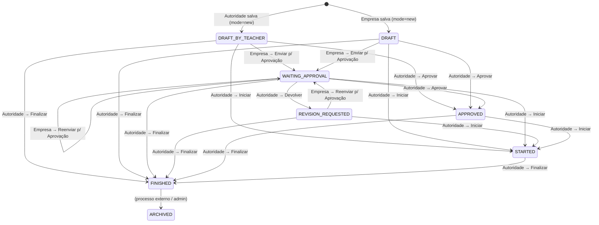

# Matriz de Fluxo de Trabalho do TCE
> ⚡ Atualizada em 2026-06-04 — reflete as alterações nas combinações 3 e 6.
> Extraída de [`+page.svelte`](file:///c:/Users/LuizCarlos/Desktop/git/GetMaisDigitalOcean/frontend/src/routes/gotce/v2/+page.svelte) — lógica `pageConfig` (linhas 22–178)

## Legenda de Papéis
- **Autoridade** = `teacher`, `admin` ou `sudo` (`isProf = true`)
- **Empresa** = `company` (qualquer role que não seja autoridade)

## Legenda de Botões
| Botão | Flag | Status destino |
|---|---|---|
| Salvar Estágio / Atualizar Estágio | `canSave` | (mesmo status, só salva dados) |
| Gerar PDF | `canPDF` | (não muda status) |
| Enviar para Aprovação | `canSubmitForApproval` | → `WAITING_APPROVAL` |
| Aprovar Estágio | `canApprove` | → `APPROVED` |
| Devolver (Rejeitar) | `canReject` | → `REVISION_REQUESTED` |
| Iniciar Estágio | `canStart` | → `STARTED` |
| Finalizar Estágio | `canFinish` | → `FINISHED` |

---

## Combinação 0 — `mode = new` (criação, qualquer role)
> Status equivalente: **NEW** — formulário em branco ainda sem ID

| # | Campo | Valor |
|---|---|---|
| Editável? | ✅ Sim |
| Mensagem | "Este TCE encontra-se em criação. Preencha os dados e clique em Salvar Estágio." |
| Salvar | ✅ (ao salvar cria o registro com status `DRAFT_BY_TEACHER` se autoridade, ou `DRAFT` se empresa) |
| PDF | ❌ |
| Enviar p/ Aprovação | ❌ |
| Aprovar | ❌ |
| Devolver | ❌ |
| Iniciar | ❌ |
| Finalizar | ❌ |

> **Obs.:** Após salvar, o `$effect` redireciona para `?id=<novo_id>` automaticamente.

---

## Status: DRAFT_BY_TEACHER

### Combinação 1 — `DRAFT_BY_TEACHER` + **Autoridade**

| Campo | Valor |
|---|---|
| Editável? | ✅ Sim |
| Mensagem | "Professor, o TCE está em modo de edição. Copie o link e envie à empresa para preenchimento." |
| Salvar | ✅ |
| PDF | ✅ |
| Enviar p/ Aprovação | ❌ |
| Aprovar | ✅ → `APPROVED` |
| Devolver | ❌ |
| Iniciar | ✅ → `STARTED` |
| Finalizar | ✅ → `FINISHED` |

### Combinação 2 — `DRAFT_BY_TEACHER` + **Empresa**

| Campo | Valor |
|---|---|
| Editável? | ✅ Sim |
| Mensagem | "O TCE encontra-se em edição. Preencha os dados, Atualize e depois Envie para o professor avaliar." |
| Salvar | ✅ |
| PDF | ✅ |
| Enviar p/ Aprovação | ✅ → `WAITING_APPROVAL` |
| Aprovar | ❌ |
| Devolver | ❌ |
| Iniciar | ❌ |
| Finalizar | ❌ |

---

## Status: DRAFT

### Combinação 3 — `DRAFT` + **Autoridade**

| Campo | Valor |
|---|---|
| Editável? | ✅ Sim |
| Mensagem | "Professor, este TCE está sendo editado pela empresa. Caso esteja fora do prazo, verifique e adote providências. Se necessário, altere para Estagiando ou Finalizado." |
| Salvar | ✅ |
| PDF | ✅ |
| Enviar p/ Aprovação | ❌ |
| Aprovar | ✅ → `APPROVED` |
| Devolver | ❌ |
| Iniciar | ✅ → `STARTED` |
| Finalizar | ✅ → `FINISHED` |

### Combinação 4 — `DRAFT` + **Empresa**

| Campo | Valor |
|---|---|
| Editável? | ✅ Sim |
| Mensagem | "O TCE encontra-se em edição. Preencha os dados, Atualize e depois Envie para o professor avaliar." |
| Salvar | ✅ |
| PDF | ✅ |
| Enviar p/ Aprovação | ✅ → `WAITING_APPROVAL` |
| Aprovar | ❌ |
| Devolver | ❌ |
| Iniciar | ❌ |
| Finalizar | ❌ |

---

## Status: WAITING_APPROVAL

### Combinação 5 — `WAITING_APPROVAL` + **Autoridade**

| Campo | Valor |
|---|---|
| Editável? | ✅ Sim |
| Mensagem | "Professor, o TCE aguarda sua aprovação. Revise e clique em Aprovar ou Devolver." |
| Salvar | ✅ |
| PDF | ✅ |
| Enviar p/ Aprovação | ❌ |
| Aprovar | ✅ → `APPROVED` |
| Devolver | ✅ → `REVISION_REQUESTED` |
| Iniciar | ✅ → `STARTED` |
| Finalizar | ✅ → `FINISHED` |

### Combinação 6 — `WAITING_APPROVAL` + **Empresa**

| Campo | Valor |
|---|---|
| Editável? | ✅ Sim |
| Mensagem | "O TCE foi enviado para aprovação do professor. Caso precise fazer ajustes, edite e reenvie para avaliação." |
| Salvar | ✅ |
| PDF | ✅ |
| Enviar p/ Aprovação | ✅ → `WAITING_APPROVAL` |
| Aprovar | ❌ |
| Devolver | ❌ |
| Iniciar | ❌ |
| Finalizar | ❌ |

---

## Status: REVISION_REQUESTED

### Combinação 7 — `REVISION_REQUESTED` + **Autoridade**

| Campo | Valor |
|---|---|
| Editável? | ✅ Sim |
| Mensagem | "Foi solicitada revisão deste TCE. Aguarde o reenvio pela empresa após as correções. Caso fora do prazo, altere para Estagiando ou Finalizado." |
| Salvar | ✅ |
| PDF | ✅ |
| Enviar p/ Aprovação | ❌ |
| Aprovar | ❌ |
| Devolver | ❌ |
| Iniciar | ✅ → `STARTED` |
| Finalizar | ✅ → `FINISHED` |

### Combinação 8 — `REVISION_REQUESTED` + **Empresa**

| Campo | Valor |
|---|---|
| Editável? | ✅ Sim |
| Mensagem | "O TCE foi devolvido para correção. Realize os ajustes e Envie para o professor avaliar." |
| Salvar | ✅ |
| PDF | ✅ |
| Enviar p/ Aprovação | ✅ → `WAITING_APPROVAL` |
| Aprovar | ❌ |
| Devolver | ❌ |
| Iniciar | ❌ |
| Finalizar | ❌ |

---

## Status: APPROVED

### Combinação 9 — `APPROVED` + **Autoridade**

| Campo | Valor |
|---|---|
| Editável? | ❌ Não (readonly) |
| Mensagem | "O TCE foi aprovado com sucesso. O estágio pode ser iniciado. Se necessário, altere para Estagiando ou Finalizado." |
| Salvar | ❌ |
| PDF | ✅ |
| Enviar p/ Aprovação | ❌ |
| Aprovar | ❌ |
| Devolver | ❌ |
| Iniciar | ✅ → `STARTED` |
| Finalizar | ✅ → `FINISHED` |

### Combinação 10 — `APPROVED` + **Empresa**

| Campo | Valor |
|---|---|
| Editável? | ❌ Não (readonly) |
| Mensagem | "O TCE foi aprovado. Agora é possível gerar o documento oficial do estágio." |
| Salvar | ❌ |
| PDF | ✅ |
| Enviar p/ Aprovação | ❌ |
| Aprovar | ❌ |
| Devolver | ❌ |
| Iniciar | ❌ |
| Finalizar | ❌ |

---

## Status: STARTED

### Combinação 11 — `STARTED` + **Autoridade**

| Campo | Valor |
|---|---|
| Editável? | ❌ Não (readonly) |
| Mensagem | "O estágio foi iniciado. Acompanhe as atividades. Se necessário, altere para Finalizado." |
| Salvar | ❌ |
| PDF | ✅ |
| Enviar p/ Aprovação | ❌ |
| Aprovar | ❌ |
| Devolver | ❌ |
| Iniciar | ❌ |
| Finalizar | ✅ → `FINISHED` |

### Combinação 12 — `STARTED` + **Empresa**

| Campo | Valor |
|---|---|
| Editável? | ❌ Não (readonly) |
| Mensagem | "O estágio encontra-se em andamento." |
| Salvar | ❌ |
| PDF | ✅ |
| Enviar p/ Aprovação | ❌ |
| Aprovar | ❌ |
| Devolver | ❌ |
| Iniciar | ❌ |
| Finalizar | ❌ |

---

## Status: FINISHED

### Combinação 13 — `FINISHED` + **Autoridade**

| Campo | Valor |
|---|---|
| Editável? | ❌ Não (readonly) |
| Mensagem | "O estágio foi concluído com sucesso." |
| Salvar | ❌ |
| PDF | ✅ |
| Todos os demais | ❌ |

### Combinação 14 — `FINISHED` + **Empresa**

| Campo | Valor |
|---|---|
| Editável? | ❌ Não (readonly) |
| Mensagem | "O estágio foi finalizado." |
| Salvar | ❌ |
| PDF | ✅ |
| Todos os demais | ❌ |

---

## Status: ARCHIVED

### Combinação 15 — `ARCHIVED` + **Autoridade**

| Campo | Valor |
|---|---|
| Editável? | ❌ Não (readonly) |
| Mensagem | "Este TCE foi arquivado para registro institucional." |
| Salvar | ❌ |
| PDF | ✅ |
| Todos os demais | ❌ |

### Combinação 16 — `ARCHIVED` + **Empresa**

| Campo | Valor |
|---|---|
| Editável? | ❌ Não (readonly) |
| Mensagem | "Este TCE foi arquivado e não pode mais ser editado." |
| Salvar | ❌ |
| PDF | ✅ |
| Todos os demais | ❌ |

---

## Diagrama de Transições de Status

---

## Resumo em Tabela Única

| # | Status TCE | Role | Editável | Salvar | PDF | Enviar | Aprovar | Devolver | Iniciar | Finalizar |
|---|---|---|:---:|:---:|:---:|:---:|:---:|:---:|:---:|:---:|
| 0 | NEW (mode=new) | qualquer | ✅ | ✅ | ❌ | ❌ | ❌ | ❌ | ❌ | ❌ |
| 1 | DRAFT_BY_TEACHER | Autoridade | ✅ | ✅ | ✅ | ❌ | ✅ | ❌ | ✅ | ✅ |
| 2 | DRAFT_BY_TEACHER | Empresa | ✅ | ✅ | ✅ | ✅ | ❌ | ❌ | ❌ | ❌ |
| 3 | DRAFT | Autoridade | ✅ | ✅ | ✅ | ❌ | ✅ | ❌ | ✅ | ✅ |
| 4 | DRAFT | Empresa | ✅ | ✅ | ✅ | ✅ | ❌ | ❌ | ❌ | ❌ |
| 5 | WAITING_APPROVAL | Autoridade | ✅ | ✅ | ✅ | ❌ | ✅ | ✅ | ✅ | ✅ |
| 6 | WAITING_APPROVAL | Empresa | ✅ | ✅ | ✅ | ✅ | ❌ | ❌ | ❌ | ❌ |
| 7 | REVISION_REQUESTED | Autoridade | ✅ | ✅ | ✅ | ❌ | ❌ | ❌ | ✅ | ✅ |
| 8 | REVISION_REQUESTED | Empresa | ✅ | ✅ | ✅ | ✅ | ❌ | ❌ | ❌ | ❌ |
| 9 | APPROVED | Autoridade | ❌ | ❌ | ✅ | ❌ | ❌ | ❌ | ✅ | ✅ |
| 10 | APPROVED | Empresa | ❌ | ❌ | ✅ | ❌ | ❌ | ❌ | ❌ | ❌ |
| 11 | STARTED | Autoridade | ❌ | ❌ | ✅ | ❌ | ❌ | ❌ | ❌ | ✅ |
| 12 | STARTED | Empresa | ❌ | ❌ | ✅ | ❌ | ❌ | ❌ | ❌ | ❌ |
| 13 | FINISHED | Autoridade | ❌ | ❌ | ✅ | ❌ | ❌ | ❌ | ❌ | ❌ |
| 14 | FINISHED | Empresa | ❌ | ❌ | ✅ | ❌ | ❌ | ❌ | ❌ | ❌ |
| 15 | ARCHIVED | Autoridade | ❌ | ❌ | ✅ | ❌ | ❌ | ❌ | ❌ | ❌ |
| 16 | ARCHIVED | Empresa | ❌ | ❌ | ✅ | ❌ | ❌ | ❌ | ❌ | ❌ |
